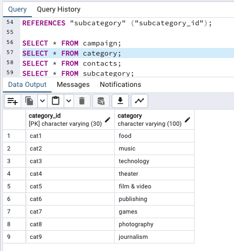

# Crowdfunding_ETL

---

## Creating table schema in QuickDBD
* Link to schema: https://app.quickdatabasediagrams.com/#/d/XDKWAu

---

### SQL Data Tables (Results after csv import)

#### Campaign table

#### Catergory table

#### Contact table

#### Subcatergory table

